## Contents
{:.no_toc}
*  
{: toc}


```python
import numpy as np
import pandas as pd
import matplotlib
import matplotlib.pyplot as plt
import sklearn.metrics as metrics
import math
from sklearn.model_selection import cross_val_score
from sklearn import tree
from sklearn.metrics import accuracy_score
from sklearn.tree import DecisionTreeClassifier
from sklearn.ensemble import RandomForestClassifier
from sklearn.ensemble import AdaBoostClassifier
from sklearn.ensemble import VotingClassifier
from sklearn.linear_model import LogisticRegressionCV
from sklearn.model_selection import cross_val_score
from sklearn.model_selection import KFold
from sklearn.model_selection import GridSearchCV
from itertools import product
from collections import OrderedDict
from scipy.stats import norm
import seaborn as sns


%matplotlib inline
```


```python
data = pd.read_csv('data_final.csv')
data = data.drop(['Unnamed: 0', 'Violent Crime', 'Rape', 'Robbery', 'Burglary',
                  'Aggravated Assault', 'Property Crime', 'Larceny-theft',
                  'Motor Vehicle Theft', 'State'], axis=1)
```


## Murder Rates Seem to Increase with City Size


```python
plt.figure(figsize=(20, 10))
sns.regplot(data['Population'], data['Murder and nonnegligent manslaughter'])
plt.xlabel('City Population', fontsize = 'xx-large')
plt.ylabel('Murders per 100K', fontsize = 'xx-large')
plt.title('Murder rate as fxn of city size', fontsize = 'xx-large')
plt.xticks(fontsize = 'xx-large')
plt.yticks(fontsize = 'xx-large')
plt.show()
```


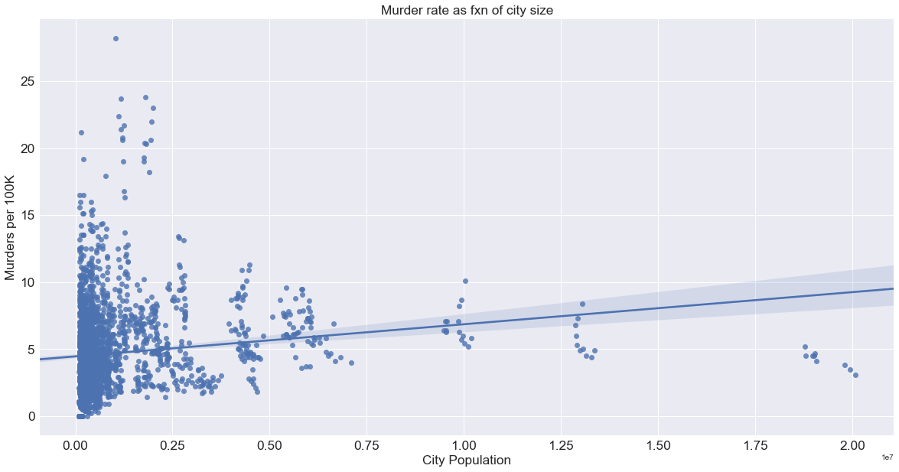


## Murder Rates Seem to Decrease with Median Household Income


```python
plt.figure(figsize=(20, 10))
sns.regplot(data['HHINCOME'], data['Murder and nonnegligent manslaughter'])
plt.xlabel('City Household Median Income', fontsize = 'xx-large')
plt.ylabel('Murders per 100K', fontsize = 'xx-large')
plt.title('Murder rate as fxn of city\'s household median income', fontsize = 'xx-large')
plt.xticks(fontsize = 'xx-large')
plt.yticks(fontsize = 'xx-large')
plt.show()
```


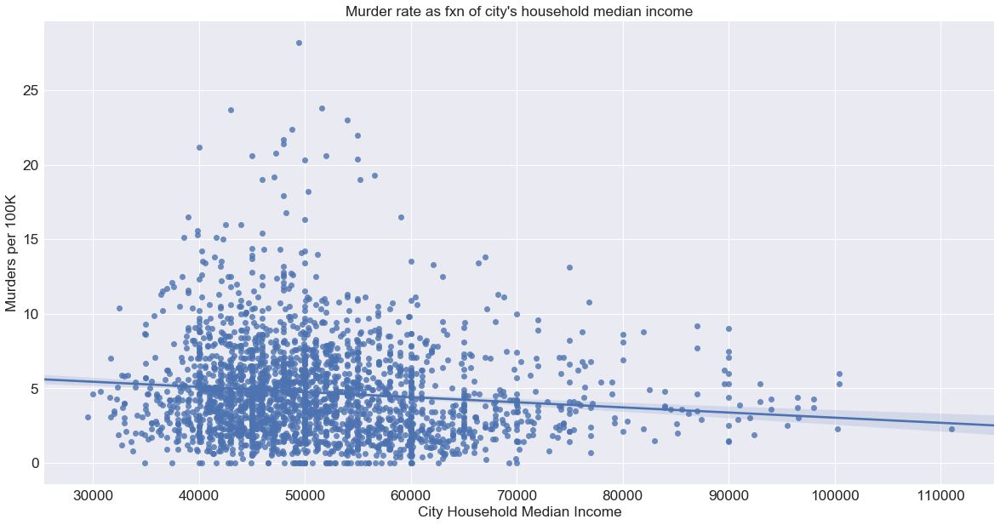


## Murder Rates Seem to Decrease with Home Ownership


```python
plt.figure(figsize=(20, 10))
sns.regplot(data['OWN'], data['Murder and nonnegligent manslaughter'])
plt.xlabel('Home Ownership Rate', fontsize = 'xx-large')
plt.ylabel('Murders per 100K', fontsize = 'xx-large')
plt.title('Murder rate as fxn of city\'s Home Ownership Rate', fontsize = 'xx-large')
plt.xticks(fontsize = 'xx-large')
plt.yticks(fontsize = 'xx-large')
plt.show()
```


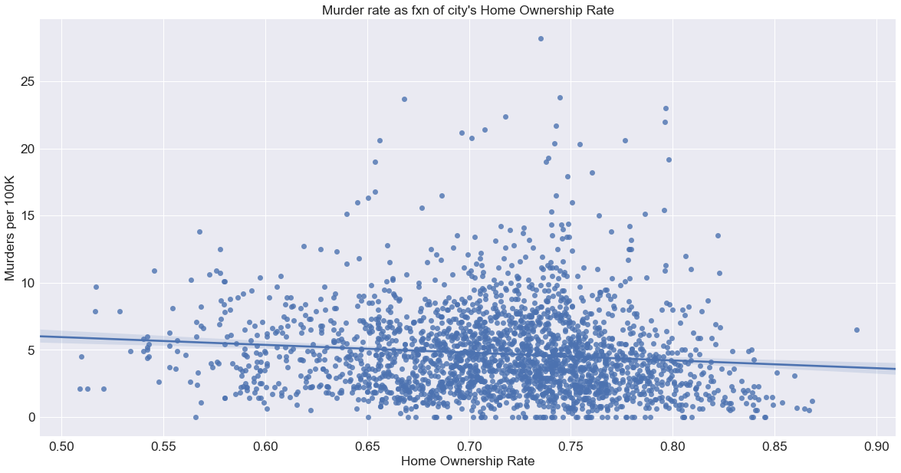


## Murder Rates Seem to Increase with Unemployment


```python
plt.figure(figsize=(20, 10))
sns.regplot(data['UNEMP'], data['Murder and nonnegligent manslaughter'])
plt.xlabel('Unemployment', fontsize = 'xx-large')
plt.ylabel('Murders per 100K', fontsize = 'xx-large')
plt.title('Murder rate as fxn of Unemployment', fontsize = 'xx-large')
plt.xticks(fontsize = 'xx-large')
plt.yticks(fontsize = 'xx-large')
plt.show()
```


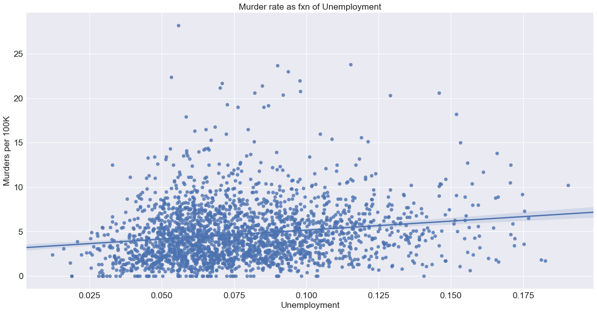


## Murder Rates Seem to Increase with Poverty


```python
plt.figure(figsize=(20, 10))
sns.regplot(data['POVERTY'], data['Murder and nonnegligent manslaughter'])
plt.xlabel('Poverty', fontsize = 'xx-large')
plt.ylabel('Murders per 100K', fontsize = 'xx-large')
plt.title('Murder rate as fxn of poverty', fontsize = 'xx-large')
plt.xticks(fontsize = 'xx-large')
plt.yticks(fontsize = 'xx-large')
plt.show()
```


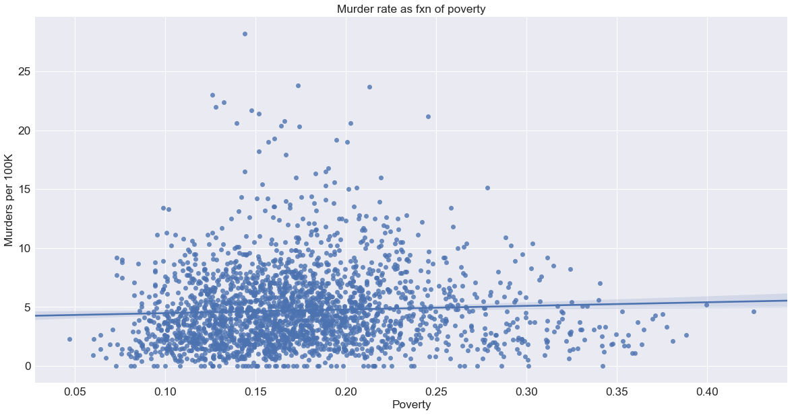


## Murder Rates Seem to Increase with Income Inequality Measured by GINI Index


```python
plt.figure(figsize=(20, 10))
sns.regplot(data['GINI'], data['Murder and nonnegligent manslaughter'])
plt.xlabel('Income Inequality (GINI)', fontsize = 'xx-large')
plt.ylabel('Murders per 100K', fontsize = 'xx-large')
plt.title('Murder rate as fxn of Income Inequality (GINI)', fontsize = 'xx-large')
plt.xticks(fontsize = 'xx-large')
plt.yticks(fontsize = 'xx-large')
plt.show()
```


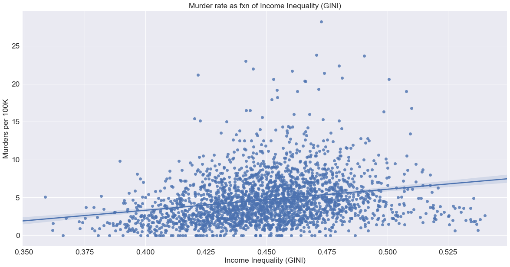


## Murder Rates Seem to Increase with % of Single Parent Households


```python
plt.figure(figsize=(20, 10))
sns.regplot(data['SINGLE_PARENT'], data['Murder and nonnegligent manslaughter'])
plt.xlabel('% Single Parent Households', fontsize = 'xx-large')
plt.ylabel('Murders per 100K', fontsize = 'xx-large')
plt.title('Murder rate as fxn of City\'s % Single Parent Households', fontsize = 'xx-large')
plt.xticks(fontsize = 'xx-large')
plt.yticks(fontsize = 'xx-large')
plt.show()
```


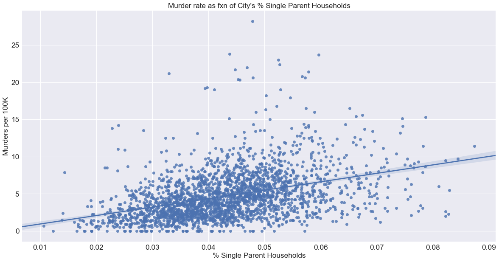


## Murder Rates Seem to Decrease with Education


```python
plt.figure(figsize=(20, 10))
sns.regplot(data['HS_ED'], data['Murder and nonnegligent manslaughter'])
plt.xlabel('% High School Graduates', fontsize = 'xx-large')
plt.ylabel('Murders per 100K', fontsize = 'xx-large')
plt.title('Murder rate as fxn of City\'s % High School Graduates', fontsize = 'xx-large')
plt.xticks(fontsize = 'xx-large')
plt.yticks(fontsize = 'xx-large')
plt.show()
```


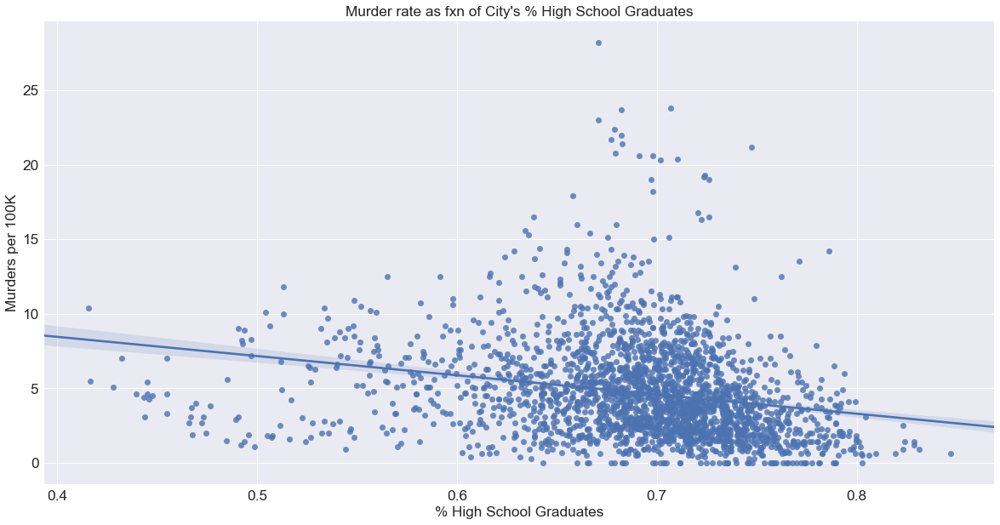


```python
plt.figure(figsize=(20, 10))
sns.regplot(data['COL_ED'], data['Murder and nonnegligent manslaughter'])
plt.xlabel('% 4 Year College Graduates', fontsize = 'xx-large')
plt.ylabel('Murders per 100K', fontsize = 'xx-large')
plt.title('Murder rate as fxn of City\'s % High School Graduates', fontsize = 'xx-large')
plt.xticks(fontsize = 'xx-large')
plt.yticks(fontsize = 'xx-large')
plt.show()
```


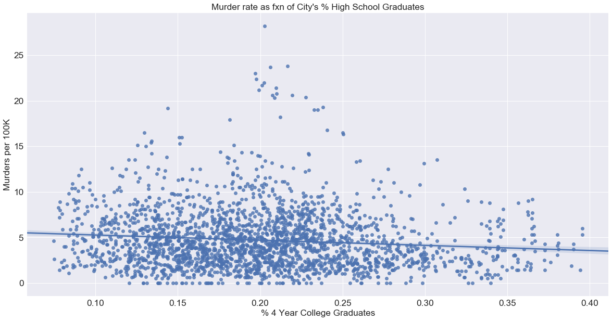


## City's % of Immigrants (proxied by non-English speakers) Seems to Have Little Effect on Murder Rates


```python
plt.figure(figsize=(20, 10))
sns.regplot(data['IMG'], data['Murder and nonnegligent manslaughter'])
plt.xlabel('% Immigrants (Proxied by English as a Second Language)', fontsize = 'xx-large')
plt.ylabel('Murders per 100K', fontsize = 'xx-large')
plt.title('Murder rate as fxn of City\'s % Immigrants (Proxied by English as a Second Language)',
          fontsize = 'xx-large')
plt.xticks(fontsize = 'xx-large')
plt.yticks(fontsize = 'xx-large')
plt.show()
```


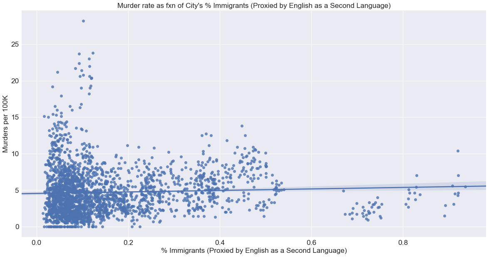


## City's % of Non-Citizens Seems to Have Little Effect on Murder Rates


```python
plt.figure(figsize=(20, 10))
sns.regplot(data['FOREIGN'], data['Murder and nonnegligent manslaughter'])
plt.xlabel('% Non-Citizens', fontsize = 'xx-large')
plt.ylabel('Murders per 100K', fontsize = 'xx-large')
plt.title('Murder rate as fxn of City\'s % Non-Citizens',
          fontsize = 'xx-large')
plt.xticks(fontsize = 'xx-large')
plt.yticks(fontsize = 'xx-large')
plt.show()
```


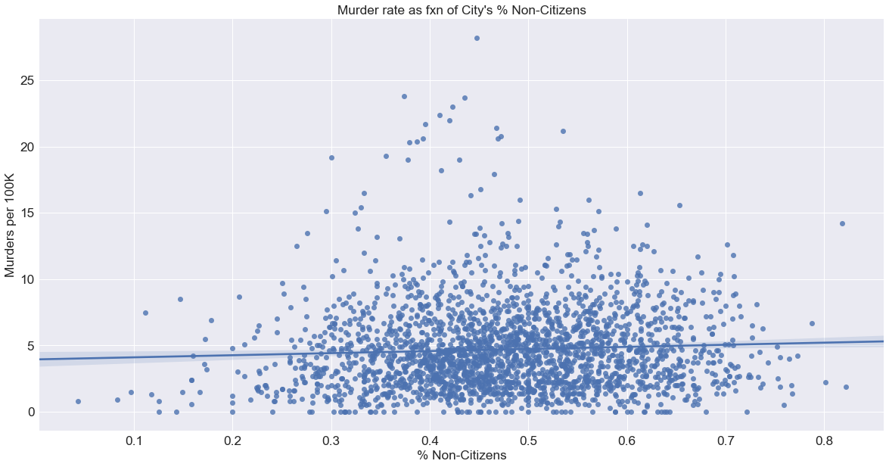


## There Seems to be Regional Variation in Murder Rates


```python
regional = pd.read_csv('fbi_ipmus_float_merge.csv')
```


```python
def get_state(state_name):
    state = state_name.split('-')[0]
    return state

def get_region(state):
    west = ['WA', 'OR', 'ID', 'MT', 'WY', 'CA', 'NV', 'UT', 'CO', 'AK', 'HI']
    sw = ['TX', 'AZ', 'NM', 'OK']
    mw = ['ND', 'SD', 'NE', 'KS', 'MN', 'IA', 'MO', 'WI', 'IL', 'MI', 'IN', 'OH']
    ne = ['MA', 'PA', 'NJ', 'NY', 'CT', 'RI', 'VT', 'NH', 'ME']
    se = ['DL', 'DC', 'VA', 'WV', 'KY', 'TN', 'NC', 'AK', 'LA', 'MS', 'AL', 'GA', 'SC', 'FL']
    region = np.nan
    if state in west:
        region = 'West'
    else:
        if state in sw:
            region = 'SW'
        else:
            if state in ne:
                region = 'NE'
            else:
                if state in se:
                    region = 'SE'
                else:
                    if state in mw:
                        region = 'MW'
    return region

def region(data):
    data['Region'] = data['State'].apply(get_state)
    data['Region'] = data['Region'].apply(get_region)
    return data

regional = region(regional)
```


```python
regional = regional.groupby('Region')['Murder and nonnegligent manslaughter'].mean().reset_index()
```


```python
plt.figure(figsize=(20, 10))
sns.barplot(regional['Region'], regional['Murder and nonnegligent manslaughter'])
plt.xlabel('Region', fontsize = 'xx-large')
plt.ylabel('Murders per 100K', fontsize = 'xx-large')
plt.title('Murder rate as fxn of Region',
          fontsize = 'xx-large')
plt.xticks(fontsize = 'xx-large')
plt.yticks(fontsize = 'xx-large')
plt.show()
```


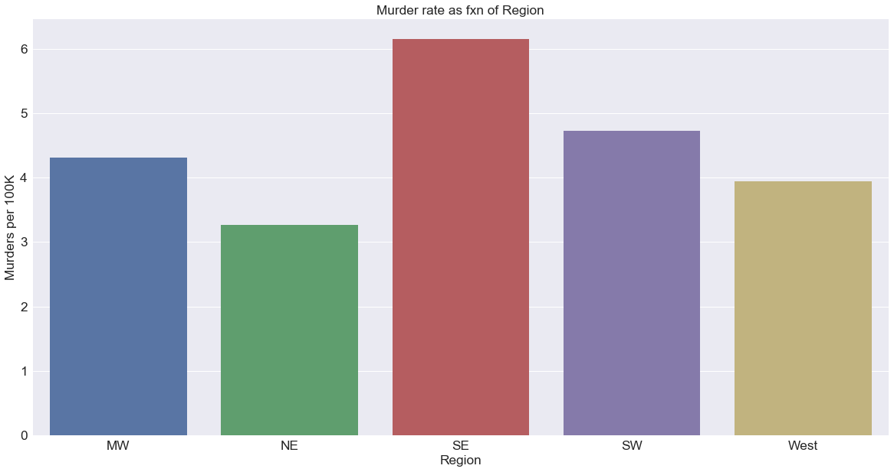


## ## There Seems to be Variation Between Cities in Murder Rates


```python
city = pd.read_csv('fbi_ipmus_float_merge.csv')
city = city.groupby('MSA')['Murder and nonnegligent manslaughter'].mean().reset_index()
city = city.sort_values('Murder and nonnegligent manslaughter')
best_worst = pd.concat([city.iloc[-2:], city.iloc[0:2]])
```


```python
plt.figure(figsize=(20, 10))
sns.barplot(best_worst['MSA'], best_worst['Murder and nonnegligent manslaughter'])
plt.xlabel('City', fontsize = 'xx-large')
plt.ylabel('Murders per 100K', fontsize = 'xx-large')
plt.title('Murder rate as fxn of City',
          fontsize = 'xx-large')
plt.xticks(fontsize = 'xx-large')
plt.yticks(fontsize = 'xx-large')
plt.show()
```


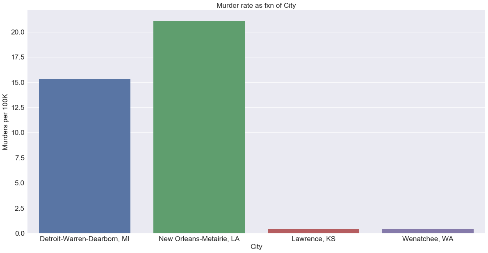
